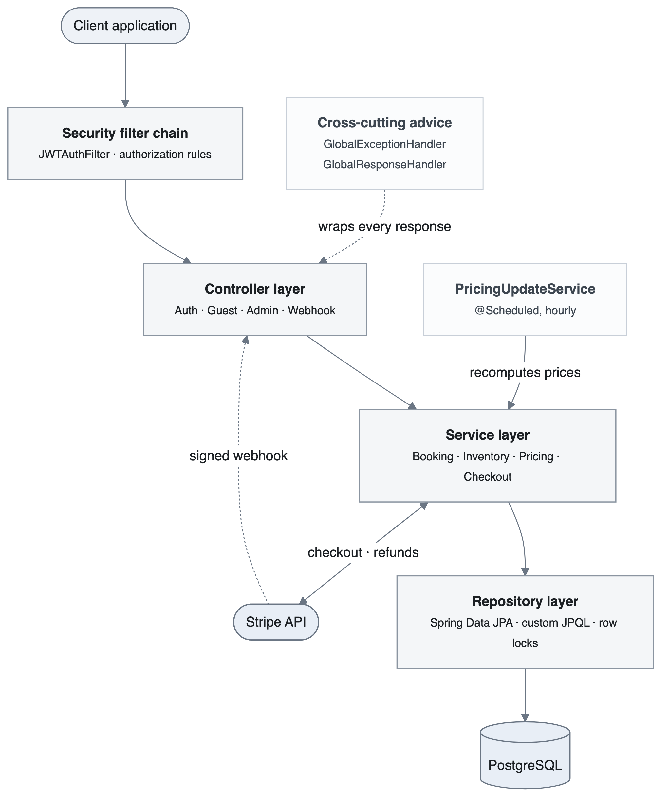
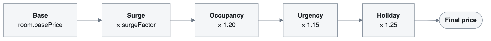
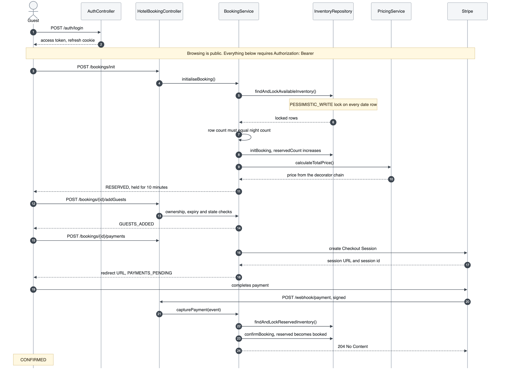
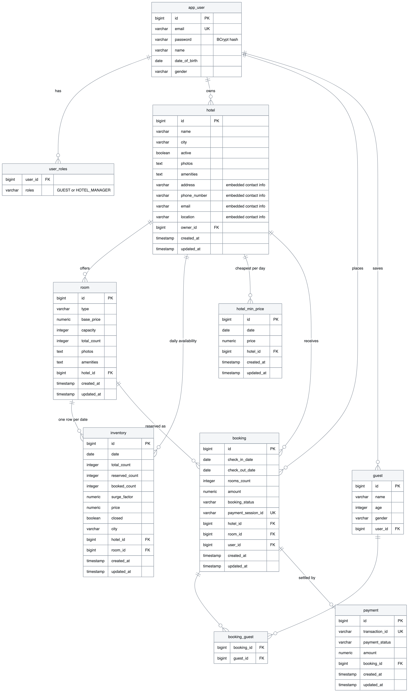
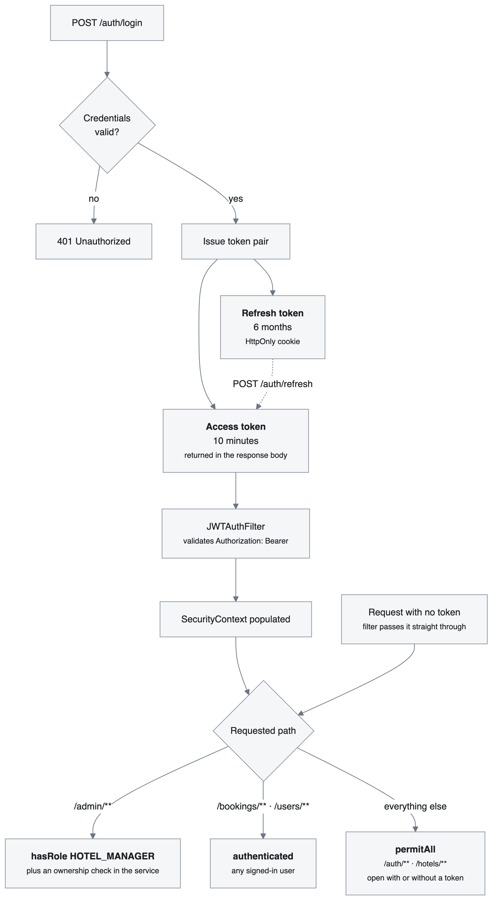

<div align="center">

# 🛎️ EasyStay

**A hotel booking and property management API**

Day-level inventory control · Dynamic pricing · Stripe payments · Role-based administration

<br>


</div>

<br>

## About the project

**EasyStay is the backend for an online hotel-booking marketplace** — the kind of system that sits behind a site like Booking.com or Airbnb. It is a REST API written in Spring Boot, and it covers the whole journey end to end: a traveller finding a room and paying for it, and a hotel owner listing a property and getting paid.

A **property** here is a hotel. It belongs to an owner, sits in a city, and contains one or more **room types** — a deluxe room, a suite — each with its own base price, guest capacity and number of physical rooms. Availability is tracked for every room type on every individual date, which is what lets the system answer "are three deluxe rooms free from the 12th to the 15th?" and price those particular nights.

<table>
<tr>
<th align="left" width="50%">🧳 &nbsp;What a guest can do</th>
<th align="left" width="50%">🏢 &nbsp;What a hotel owner can do</th>
</tr>
<tr valign="top">
<td>

Register and log in. Search any city for a date range and see live prices. Hold a room, add the people travelling along, and pay through Stripe. Cancel a confirmed stay and be refunded automatically. Keep a profile, a list of frequent travellers and a full booking history.

</td>
<td>

List a hotel and define its room types. Publish it, which generates a year of availability. Close individual dates, push prices up over a busy weekend, read every booking made against the property, and pull a revenue report for any period.

</td>
</tr>
</table>

### What makes it interesting

Booking is a deceptively hard problem: money, concurrency and time-sensitive stock all meet in one request. These are the pieces built to handle that.

| | Feature | What it does |
| :---: | :--- | :--- |
| 💳 | **Stripe payment integration** | Each booking opens a hosted Stripe Checkout session. The booking is confirmed by Stripe's **signed webhook**, never by the browser redirect, so a guest closing the tab mid-payment still gets confirmed and a forged success URL confirms nothing. Cancelling a stay issues a real refund against the original payment intent. |
| 🎁 | **Dynamic pricing — Strategy + Decorator** | A room's price is calculated, not stored. Four rules — surge, occupancy, urgency and holiday — each wrap the one before it, stacking multipliers on a base rate. Adding a weekend rate later costs one class and one line, with no existing rule touched. |
| 🔐 | **JWT authentication and authorization** | Stateless login issuing a short access token plus a long refresh token held in an `HttpOnly` cookie. Roles separate guests from hotel managers, and every admin action additionally re-checks that you actually own the hotel you are editing. |
| 🔒 | **Race-condition-safe inventory** | Two guests taking the last room at the same instant is the obvious way to break a booking site. Reservations take a `PESSIMISTIC_WRITE` lock on the exact dates, and the update repeats the availability check in its own `WHERE` clause, so overselling cannot happen. |
| ⏱️ | **Scheduled repricing** | An hourly job reruns the pricing chain across every date and rolls the results into a lookup table, so search reads a precomputed cheapest-per-day price instead of recalculating on every request. |
| 📦 | **Production-minded API surface** | One response envelope for every endpoint, a global exception handler that never leaks a stack trace, and interactive OpenAPI documentation through Swagger UI. |

<br>

## Contents

**1.** [Overview](#1--overview) · **2.** [Technology](#2--technology) · **3.** [Architecture](#3--architecture) · **4.** [Pricing engine](#4--pricing-engine) · **5.** [Booking lifecycle](#5--booking-lifecycle) · **6.** [Data model](#6--data-model) · **7.** [Security](#7--security) · **8.** [API reference](#8--api-reference) · **9.** [Running locally](#9--running-locally) · **10.** [Known gaps](#10--known-gaps)

---

## 1. 📋 Overview

Two design decisions shape everything else in the codebase.

**Inventory is materialised, not calculated.** Activating a hotel writes 365 rows per room type, one per calendar day. Availability becomes an indexed range scan rather than an interval-overlap query, and per-date closures, surge factors and prices reduce to ordinary columns.

**Price is a computation, not a column.** Each night is priced by a chain of rules composed at runtime, recomputed hourly by a scheduler and rolled up into a lookup table that search reads from directly.

---

## 2. 🧰 Technology

| Layer | Choice |
| :--- | :--- |
| Language | Java 21 (LTS) |
| Framework | Spring Boot 4.1.1 — Web MVC, Data JPA, Security, Scheduling |
| Persistence | PostgreSQL with Hibernate |
| Authentication | Spring Security, JJWT 0.12.6, BCrypt |
| Payments | Stripe Java SDK 33.4.2 — Checkout, Refunds, Webhooks |
| Object mapping | ModelMapper 3.2.6 |
| Documentation | SpringDoc OpenAPI 3, Swagger UI 2.8.3 |
| Build | Maven, wrapper included |

---

## 3. 🏗️ Architecture

Controllers stay thin, services hold the logic, repositories own the SQL. Two `@RestControllerAdvice` classes cut across every request: one converts exceptions into structured JSON, the other wraps every response body in a single consistent envelope.

<div align="center">
  
</div>

### Package layout

```
com.sagar.project.airBnbApp
│
├── controller      REST endpoints — guest, admin and webhook surfaces
├── service         business logic, an interface and an implementation per service
├── repository      Spring Data JPA, custom JPQL, lock annotations
├── entity          JPA entities and enums
├── dto             request and response contracts
├── security        JWTService, JWTAuthFilter, AuthService, WebSecurityConfig
├── strategy        pricing rules and their composition
├── advice          exception handler and response envelope
├── exception       ResourceNotFoundException, UnAuthorisedException
├── config          ModelMapper and Stripe bean configuration
└── util            authenticated-user resolution
```

---

## 4. 💰 Pricing engine

Every rule implements a single `PricingStrategy` interface, and each rule wraps the one before it. That is **Strategy** for the interchangeable algorithms and **Decorator** for the way they stack.

<div align="center">
  
</div>

| Rule | Applies when | Effect |
| :--- | :--- | :--- |
| `BasePricingStrategy` | always | `room.basePrice` |
| `SurgePricingStrategy` | always | × the manager's surge factor |
| `OccupancyPricingStrategy` | more than 80% of the room type is booked | × 1.20 |
| `UrgencyPricingStrategy` | the stay begins within 7 days | × 1.15 |
| `HolidayPricingStrategy` | the date is a holiday | × 1.25 |

```java
public BigDecimal calculateDynamicPricing(Inventory inventory) {
    PricingStrategy pricingStrategy = new BasePricinngStrategy();

    pricingStrategy = new SurgePricingStrategy(pricingStrategy);
    pricingStrategy = new OccupancyPricingStrategy(pricingStrategy);
    pricingStrategy = new UrgencyPricingStrategy(pricingStrategy);
    pricingStrategy = new HolidayPricingStrategy(pricingStrategy);

    return pricingStrategy.calculatePrice(inventory);
}
```

> [!TIP]
> Introducing a weekend rate or a loyalty discount means one new class and one new line. No existing rule is touched.

A scheduled job runs this chain hourly across every inventory row, then reduces the results to the cheapest price per hotel per day in a `HotelMinPrice` table. Search queries that table instead of recomputing prices across a join on every request, which keeps the hot path cheap.

### Patterns used elsewhere

| Pattern | Location | Purpose |
| :--- | :--- | :--- |
| Strategy | `PricingStrategy` and five implementations | interchangeable algorithms behind one contract |
| Decorator | Surge, Occupancy, Urgency, Holiday | stackable modifiers composed at runtime |
| Repository | `repository` package | persistence kept out of business logic |
| Data transfer object | `dto` package with ModelMapper | entities never reach the API surface |
| Builder | `Booking`, `Inventory`, `ApiError` via Lombok | readable construction of wide objects |
| Dependency injection | `@RequiredArgsConstructor` throughout | immutable, testable services |
| Chain of responsibility | Spring Security filter chain | each filter handles one concern and delegates |
| Facade | `BookingServiceImpl` | fronts inventory, pricing, checkout and persistence |
| Adapter | `User implements UserDetails` | domain entity fitted to a framework contract |

---

## 5. 🔄 Booking lifecycle

Searching and viewing a hotel are open to anyone, but booking is not. `/bookings/**` requires authentication, and `initialiseBooking` stamps the new booking with `getCurrentUser()`, so the guest has to log in and send the access token before the flow can start. Everything after that runs across two systems that must agree at the end: this database and Stripe.

<div align="center">
  
</div>

States advance `RESERVED → GUESTS_ADDED → PAYMENTS_PENDING → CONFIRMED`, with `CANCELLED` and `EXPIRED` as terminal exits.

> [!IMPORTANT]
> Confirmation is driven by the signed Stripe webhook rather than the browser redirect. A guest who closes the tab immediately after paying still ends up confirmed, and a guest who navigates directly to the success URL does not.

Cancellation accepts only confirmed bookings. The affected rows are locked, `bookedCount` is decremented so the nights return to sale, the original `PaymentIntent` is read back from the stored session, and a refund is issued.

### 🔐 Preventing double-booking

Two guests selecting the last room in the same instant is the obvious failure mode. Three mechanisms close it.

**1. The availability read takes the write lock.** A second transaction blocks rather than reading counters that are about to change.

```java
@Lock(LockModeType.PESSIMISTIC_WRITE)
@Query("""
    SELECT i FROM Inventory i
    WHERE i.room.id = :roomId
      AND i.date BETWEEN :startDate AND :endDate
      AND i.closed = false
      AND (i.totalCount - i.bookedCount - i.reservedCount) >= :roomCount
""")
List<Inventory> findAndLockAvailableInventory(...);
```

**2. The write re-asserts the same condition.** Even reached without a lock, the update cannot oversell, because the guard lives in the `WHERE` clause.

```java
@Modifying
@Query("""
    UPDATE Inventory i SET i.reservedCount = i.reservedCount + :numberOfRooms
    WHERE i.room.id = :roomId
      AND i.date BETWEEN :startDate AND :endDate
      AND (i.totalCount - i.bookedCount - i.reservedCount) >= :numberOfRooms
      AND i.closed = false
""")
void initBooking(...);
```

**3. Row count is validated against night count.** If fewer rows come back than nights requested, at least one date is unavailable and the whole transaction rolls back.

Reservations also carry a ten-minute expiry, so an abandoned checkout stops holding rooms indefinitely.

---

## 6. 🗄️ Data model

Eleven tables, generated by Hibernate from the JPA entities.

<div align="center">
  
</div>

`inventory` is the centre of gravity. It holds three counters per night — `total_count`, `reserved_count` and `booked_count` — which together separate a room held during checkout from one that is genuinely sold. A unique constraint on `(hotel_id, room_id, date)` makes a duplicate day impossible at the database level.

A few tables exist because of how the entities are mapped rather than because they were designed by hand. `user_roles` is the element collection behind `User.roles`, so a single user can hold both `GUEST` and `HOTEL_MANAGER`. `booking_guest` is the join table for the many-to-many between a booking and the travellers on it, which lets one saved guest appear across several bookings. The four contact columns on `hotel` — `address`, `phone_number`, `email` and `location` — come from the `HotelContactInfo` `@Embeddable`, so they live on the hotel row rather than in a table of their own.

---

## 7. 🔐 Security

Authentication is stateless. Logging in returns a short-lived access token in the response body and sets a long-lived refresh token as an `HttpOnly` cookie, which keeps it out of reach of client-side JavaScript.

<div align="center">
  
</div>

| Control | Implementation |
| :--- | :--- |
| Session policy | `STATELESS`; CSRF disabled because no cookie carries authentication state |
| Tokens | HMAC-SHA signed, parsed and verified on every request by `JWTAuthFilter` |
| Passwords | BCrypt with a per-password salt |
| URL authorization | `/admin/**` requires `HOTEL_MANAGER`; `/bookings/**` and `/users/**` require authentication; the remainder is public |
| Resource authorization | every admin service independently verifies ownership of the hotel or room |
| Error handling | `AccessDeniedHandler` and `@RestControllerAdvice` return JSON, never a stack trace |

> [!IMPORTANT]
> URL rules are only the outer gate. Holding the `HOTEL_MANAGER` role should not let you edit somebody else's property, so each service re-checks the owner against the authenticated principal before acting.

Note that `permitAll` is not the same as "logged out only". A request carrying a valid token reaches `/hotels/search` exactly as a request without one does — the rule places no requirement on the caller either way. A request with no `Authorization` header simply passes through `JWTAuthFilter` untouched, leaving the security context empty, and then succeeds or fails purely on whichever rule matches its path.

`User.equals` compares by identifier rather than by reference, since the principal held in the security context and an entity freshly loaded from the database are different instances of the same person.

---

## 8. 📡 API reference

Base URL `http://localhost:8080/api/v1` · Swagger UI at `/api/v1/swagger-ui/index.html`

#### 🔑 Authentication &nbsp;

| Method | Endpoint | Description |
| :--- | :--- | :--- |
| `POST` | `/auth/signup` | Register a new account, assigned the `GUEST` role |
| `POST` | `/auth/login` | Return an access token and set the refresh cookie |
| `POST` | `/auth/refresh` | Exchange the refresh cookie for a new access token |

#### 🔎 Browse &nbsp;

| Method | Endpoint | Description |
| :--- | :--- | :--- |
| `GET` | `/hotels/search` | Paginated search by city, date range and room count |
| `GET` | `/hotels/{hotelId}/info` | Hotel profile together with its room types |

#### 🛎️ Bookings &nbsp; 

| Method | Endpoint | Description |
| :--- | :--- | :--- |
| `POST` | `/bookings/init` | Lock inventory, price the stay, create the booking |
| `POST` | `/bookings/{id}/addGuests` | Attach travellers to the booking |
| `POST` | `/bookings/{id}/payments` | Create a Stripe session and return the payment URL |
| `POST` | `/bookings/{id}/status` | Current position in the state machine |
| `POST` | `/bookings/{id}/cancel` | Cancel, release inventory and issue a refund |

#### 👤 Profile and saved guests &nbsp;

| Method | Endpoint | Description |
| :--- | :--- | :--- |
| `GET` `PATCH` | `/users/profile` | Read or partially update the profile |
| `GET` | `/users/myBookings` | Booking history for the current user |
| `GET` `POST` | `/users/guests` | List or add a saved traveller |
| `PUT` `DELETE` | `/users/guests/{guestId}` | Update or remove a saved traveller |

#### 🏢 Administration &nbsp; 

| Method | Endpoint | Description |
| :--- | :--- | :--- |
| `GET` `POST` | `/admin/hotels` | List owned hotels or create one |
| `GET` `PUT` `DELETE` | `/admin/hotels/{hotelId}` | Read, update or delete a hotel |
| `PATCH` | `/admin/hotels/{hotelId}/activate` | Publish the hotel and generate a year of inventory |
| `GET` | `/admin/hotels/{hotelId}/bookings` | Every booking against the property |
| `GET` | `/admin/hotels/{hotelId}/reports` | Revenue report, `startDate` and `endDate` optional |
| `POST` `GET` | `/admin/hotels/{hotelId}/rooms` | Create or list room types |
| `GET` `PUT` `DELETE` | `/admin/hotels/{hotelId}/rooms/{roomId}` | Manage a single room type |
| `GET` | `/admin/inventory/rooms/{roomId}` | Day-by-day inventory for a room |
| `PATCH` | `/admin/inventory/rooms/{roomId}` | Bulk surge factor or closure across a date range |

#### 🪝 Webhook &nbsp;

| Method | Endpoint | Description |
| :--- | :--- | :--- |
| `POST` | `/webhook/payment` | Stripe events, verified against the `Stripe-Signature` header |

### Response envelope

`GlobalResponseHandler` wraps every body, so a client parses one shape regardless of endpoint.

```jsonc
// success
{
  "timeStamp": "2025-09-23T10:15:30.123",
  "data": {
    "id": 12,
    "bookingStatus": "RESERVED",
    "amount": 7350.00
  }
}

// failure
{
  "timeStamp": "2025-09-23T10:16:02.771",
  "error": {
    "status": "NOT_FOUND",
    "message": "Hotel not found with id: 99",
    "subErrors": null
  }
}
```

---

## 9. ⚙️ Running locally

**Prerequisites** — JDK 21 or newer, PostgreSQL 14 or newer, and a Stripe account in test mode.

**1. Clone and create the database.**

```bash
git clone https://github.com/sagaryadav-04/EasyStay.git
cd EasyStay
```

```sql
CREATE DATABASE "airBnb";
```

**2. Configure `src/main/resources/application.properties`.**

```properties
spring.datasource.url=jdbc:postgresql://localhost:5432/airBnb
spring.datasource.username=${DB_USERNAME}
spring.datasource.password=${DB_PASSWORD}
spring.jpa.hibernate.ddl-auto=update

server.servlet.context-path=/api/v1

jwt.secretKey=${JWT_SECRET}

frontend.url=http://localhost:8080
stripe.secret.key=${STRIPE_SECRET_KEY}
stripe.webhook.secret=${STRIPE_WEBHOOK_SECRET}
```

**3. Start the application.** Hibernate creates the schema on first boot.

```bash
./mvnw spring-boot:run      # macOS and Linux
mvnw.cmd spring-boot:run    # Windows
```

**4. Forward Stripe webhooks** so payments can complete against a local server.

```bash
stripe listen --forward-to localhost:8080/api/v1/webhook/payment
```

> [!TIP]
> Copy the `whsec_...` value this command prints into `stripe.webhook.secret`. Without it, payments succeed on Stripe's side but bookings never reach `CONFIRMED`.

**5. Verify the setup.**

```bash
# register an account
curl -X POST http://localhost:8080/api/v1/auth/signup \
  -H "Content-Type: application/json" \
  -d '{"email":"guest@easystay.com","password":"secret123","name":"Test Guest"}'

# log in and copy the token from the response
curl -X POST http://localhost:8080/api/v1/auth/login \
  -H "Content-Type: application/json" \
  -d '{"email":"guest@easystay.com","password":"secret123"}'

# call a protected endpoint
curl http://localhost:8080/api/v1/users/profile \
  -H "Authorization: Bearer ACCESS_TOKEN"
```

---

## 10. 📌 Known gaps

> [!NOTE]
> Current limitations, kept here deliberately rather than left to be discovered.

- **Expired reservations are not swept.** Expiry is evaluated when a booking is read, so held inventory is not returned to sale until something touches that booking. A scheduled sweeper is the fix.
- **Holiday detection is stubbed.** `HolidayPricingStrategy` currently treats every date as a holiday. It needs a calendar source behind it.
- **Test coverage is thin.** Only the context-load test exists. Testcontainers against a real PostgreSQL instance would be the right foundation.
- **Search results are uncached.** The `HotelMinPrice` rollup keeps queries cheap, but a cache in front of it is the next step under load.
- **No container setup.** Getting started still requires a locally installed PostgreSQL.

---

<div align="center">

**Sagar Yadav** · [github.com/sagaryadav-04](https://github.com/sagaryadav-04)

</div>
